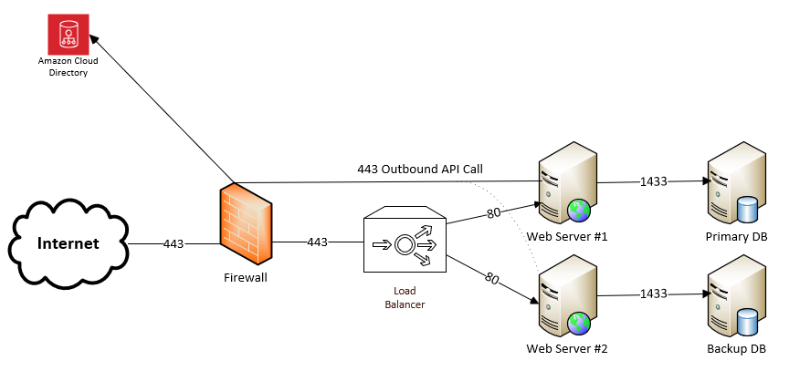

- [Start Here](#start-here)
  - [Subject Matter Areas](#subject-matter-areas)
- [Triage Rules of the Road](#triage-rules-of-the-road)
  - [Do Not Panic](#do-not-panic)
  - [Data Must Guide the Process](#data-must-guide-the-process)
  - [Document the Triage Process](#document-the-triage-process)
  - [Complex issues often require special skills that may require outside resources](#complex-issues-often-require-special-skills-that-may-require-outside-resources)
- [The Triage Process (or one version of it)](#the-triage-process-or-one-version-of-it)
  - [Listen](#listen)
  - [Documentation Phase](#documentation-phase)
    - [Jargon Deciphering](#jargon-deciphering)
  - [Data Gathering](#data-gathering)

# Start Here 

If you already know the root cause of your application issue, please feel free to go straight to the respective subject matter guide such as networking, disk, etc.  If the issue is still unclear, please start here.  We will start with the basic triage best practices giving a high-level overview before jumping into the details.

## Subject Matter Areas 

To be honest, you could have put everything into a single document, but it would have been a bit more difficult to navigate so I picked the following subjects.  Feel free to re-arrange as you see fit.

1. [Database Issues](./Database.md)
   1. Blocks, locks, slow queries
2. [Disk or File or Storage Issue](./DiskFileStorage.md)
   1. File transfer issues, SAN/NAS issues
3. [Network Issues](./Network.MD)
   1. Bandwidth, latency, dropped packets, blocked packets, etc
4. [Security Issues](./Security.md)
   1. AD, Linux controls, anti-virus, GPO, etc
5. [Server Issues](./Server.md)
   1. Memory contraints, CPU and process issues, etc
6. [Web App Issues](./WebApplications.md)
   1. Apache, IIS, memory leaks

# Triage Rules of the Road

1. Do not panic
2. Let data guide the triage process 
   1. Remove emotions / guessing 
   2. Remove biases
3. Document your triage journey from beginning to end
4. If you are missing expertise in an area, get it or buy it

## Do Not Panic

Douglas Adams once wrote an exceptional book called "The Hitchhiker's Guide to the Galaxy" which has their guide starting with some very imporantant guidance, "do not panic."  Why would I bother putting this in this guide?  I've been helping teams with application triage for 30 years, and I often see people panic when they get on a triage call because they worry about the application impact.   That is understandable, but the behavior will not fix the issue.   That is why I suggest you think about this while you are dealing with stressed out IT managers and application owners.   Focus on the underlying issue in a calm, logical fashion with data being the critical input.   Let the other people panic and worry while you channel your inner Douglas Adams focusing on the issue.

## Data Must Guide the Process

Having lost days of my life sitting on application triage calls, most of the time-wasting has been generated by people making blind guesses.  You might hear phrases such as "didn't we patch last weekend" or "do we have a network issue".  We would all be millionaires if we had a nickel every time an IT Manager starting asking questions about the network.  All of these things have nothing to do with the issue at hand even if the occasional guess is right.   Some issues may be easy issues that can be solved in 30 minutes or less such as high CPU on a single server, but the more complex issues may not be as clear.  For those issues, the data will lead you to the root cause than people making guesses wasting everyone's time.

Data does not lie.  

Let me repeat, data does not lie.   People lie.  Data does not lie.  People may misinterpret the data, but the data itself does not lie.

I once spent a lost holiday on troubleshooting calls for a "slow application" issue.   That issue turned out to be missing firewall rules that the application owner never requested.   The triage team kept asking, "what API calls are needed that we can test", etc etc.   Eventually, we used Wireshark which uncovered SYN packets to an AWS address that was being unanswered thus causing a 60 second timeout.   In short, the people lied, and Wireshark did not lie.  This may seem a little hard on humanity, but after 60 or 500 troubleshooting calls, you start seeing the same patterns.  Then you start regretting getting pulled into yet another call where the people are not providing factual or adequate information about the issue, and you then resort to trusting the data over the humans.  I'm not recommending that you do not trust your team members, but I do recommend digging into the data to see what it says.  

Issues fall into many categories including resource contraints, memory leaks, network issues, disk latency, application configuration challenges and many others.  A quick dip into one of the categories can help provide data to corroborate or disprove a theory such as "could it be a network issue?".   A person can quickly check the Browser DevTools or use PathPing to validate packet loss or latency.  This process helps to quickly let the data guide you in certain directions.   Simple issues may only require an hour of digging while other issues may take days.   When dealing with complex systems, the vendor may be the only party able to analyze the logs, and those logs may take 8-12 hours to get an analysis.  The key idea here is to not be afraid to dig into the data when the application teams cannot or will not provide sufficient technical details. 

In the context of troubleshooting an application, biases are like having an old map that has not been updated in many years trying to get to a unknown destination.   You may find yourself attempting to find comfortable surroundings like asking about the firewalls and the DNS, but you may be missing over 70% of the diagnostic terrain.  It is common for specialist to bring their own biases with them as they may see the technical world through the lense of a netowrk expert or database administration.   Thus, it may take a group of people with their unique biases to finally see the issue in a collaborative fashion; however, stressful triage calls has a way of bringing out the most moronic ideas from the extroverts while causing most of the introverts to seek shelter from the barrage of bad ideas.   If your organization is siloed in such a way that everyone is an expert in their own area, then the calls need to respect each specialists bias in order to bring those ideas together.  Why hire an expert with 20+ years of experience if you will not listen to them?   If your organization is much smaller, then you may be dealing with generalists who bring a different type of bias based on their experiences as opposed to deep understanding of a particular topic.  As long as you acknowledge the biases which will exist, you will be able to update your diagnostic map to include different viewpoints bringing you to the resolution that much faster.   

Removing your biases may be more challenging, but it will assist with the complex issues.  For example, we had an issue that involved latency between an application and the underlying Oracle database.   Within the first 2 hours of the call, an IT Manager inquired whether they had failed over the firewalls which would only take 5 minutes and be non-impacting.   The firewall team stated that it could **not** be the issue, and the call lasted another 12 hours.   Finally, the IT Manager asked again for a failover of the firewall rules, and the failover fixed the issue.   In this case, the IT Manager was recalling a similar issue, and they wanted a quick, non-impactful change to rule it out even though it may not be the issue.   In this case, the firewall team fought the idea that it was a firewall issue because they saw the traffic being passed.   Their bias added 12 hours to the call.  In short, despite being tired and frustrated by a long technical call, it helps being unbiased and open to ideas.  

Here is yet another great example about how your biases can harm a troubleshooting process.  In one scenario, the users reported all of the applications were not functioning as expected from either the Internet or the Intranet.   We had experienced multiple firewall issues throughout the year, and everyone immediately assumed yet another firewall issue.   The triage call started with that bias, and everyone disproved it after about 1-2 hours after seeing traffic hit the servers.   Instead of the firewall, the issue was a storage component that was supposed to be completely fault-tolerant.   It was not 100% fault-tolerant.   It left the underlying storage in a read-only state because the fault-tolerant nodes could not determine the state of one node.   Thus, storage was up but not working.  Servers were up, but the SAN drives could not accept writes or reads.   If we had dropped our biases at the door, we could have save 2 hours.  That incident taught us a lesson about assumptions that we recall at the beginning of each call just in case we repeat the same mistake.

Being open to ideas and unbiased does not equate to dealing with other's biases.  People often give magical powers to what they do not understand.  For example, many people think load balancers have magical powers because they do not understand what they do and how they work.   This is true of any technology, and you might find yourself explaining why a certain technology might not be an issue just because one person does not understand it.  In one example, there was an application not sending certain attachments via email, yet it was sending other messages.  One developer insisted the SMTP server was intermittently dropping their emails, yet all the other emails were passing without issues.   In short, the developer thought the SMTP server worked like a bully on the schoolyard picking on random emails.  It added to the challenge that the application didn't log the SMTP attempts with sufficient detail.  In this case, it would be easy to get frustrated at the developer for his lack of understanding, and it might be possible that an SMTP server may drop certain large files or files that contain malicious content.  In this case, we used a PowerShell script that generated emails to the SMTP server thus proving that there were no firewall blocks or challenges with the SMTP process.   That same script allowed to test all sorts of file sizes as well thus ruling out any infrastructure issues.   Rather than get frustrated at other people's biases, think of ways to build tools/scripts/processes to rule out that issue.   Many complex issues may take days to resolve, and it will help having a toolbax of scripts that only take minutes to check as opposed to fighting with people who do not understand technology.   It's much easier to simply say, "Sure, let's test that", and then you can prove that person's ideas are completely worthless.  Similar to the previous issue with the Oracle latency, there are times when someone has the right idea right away.

## Document the Triage Process

This is self-evident, but I never see this get taken care of properly for several reasons.  

1. Ownership Issues
2. Lack of technical understanding
3. Poor leadership (see issue #1 on Ownership)
4. Fatigue   

Depending on your organization culture, there might be a lot of blame slinging.  Your leadership's focus may be on blaming people than finding your issue which is clearly not productive, and it leads people to want to stay away from the issue.  After all, who wants to be the messenger that gets hurt by carrying the message.   Depending on your organization's culture, you may want to document quietly on the call taking notes, and you do not have to share your hard work with the rest of the world.  Most triage calls start with people wanting to sound smart by asking a lot of questions about things they do not understand.   This may yield results on simple issues, but complex issues may take weeks to uncover.   For those issues, the pointy-headed IT managers with stupid questions will eventually get quiet on the call with the exception of an occasional outburst.   Thus, they will yield to logic eventually even if it takes some time to wear them down.  This is where good documentation comes into play.   If you start documenting right away, you will have a treasure trove of facts that may lead you to your root cause that much faster.   If you wait until the pointy-headed people stop talking, you may have missed critical events that can tell you about your issue.  For example, if the pointy-headed person asks for a reboot four times in a row, then you can probably safely assume that a reboot will not fix the issue if it didn't fix it the first 4 times.   I would recommend caution when dealing with loud-mouthed non-experts for the first hour of the call as that is when they are the most dangerous.  Just remember that documentation will help you when you have been awake for 23+ hours on a call when you can barely remember which IP address they just called out a few seconds ago on the call.

Regardless of the reasons why groups fail to document the journey, I would recommend that you put aside your gripes with that application that keeps pulling you into yet another call and start documenting.   You do not have to share your notes with the world, but it can help when you get tired after the 14th hour on a call. 

What do you document?  

- Scope of Issue
  - Document what is stated to be not meeting expectations with the application 
  - Time
    - Issue Start Time 
    - Issue Stop (if intermittent issue)
  - Which group of users are impacted?
  
- Changes
  - Document the changes you make to your environment during the triage process
  - Examples:
    - Firewall rule changes  
    - Host file changes 
    - Adding/removing patches   

- Tests
  - Timings 
    - How long did a process take?
  - Network 
    - Was the tester in Starbucks or their house?   Where were they testing from?   
    - What was the result at 5:00 PM or 9:30 AM?  
    - Who was the tester?  ex.  Was it a client behind a proxy?   Was it your employee at home?
  - Application Details
    - What is the EXACT process for reproducing test results  
      - TIP: Screenshots are great for this process

- Diagnosis 
  - What have you checked?  
    - Ping test - Document source/dest and results
    - DevTools on Browser - Save HAR file for review
    - Wireshark - Save PCAP file which you may need later
    - Diagnostic Tools - Take screenshots as the screens may change later 
    - Logs - Save the logs in the event that they get overwritten along with notes why you put those logs in a safe place.  
      - TIP: It is hard to remember why you saved an Apache or IIS log file a few days later much less remember which lines were important.   Feel free to put notes in your log files as you will probably have to reformat many of the files for further log analysis.   

## Complex issues often require special skills that may require outside resources

Last but not least, complex things require time and special skills to understand.   Most of the world avoids complexity.   Thus, after you have rebooted servers and checked the network, what is next?   This requires people to perform Wireshark captures or check the application logs.  These processes take time and effort.  Some things are quite easy to perform such as a reboot while other diagnostic processes like IIS process dump file analysis takes an experienced individual.  Some organizations have those people on their payrolls while others pay for support to vendors such as Microsoft, Cisco, F5, Palo Alto, and many more.  

You may get on a triage call, and you may ask for someone from the application team to analyze the application logs.  You may be met with the sound of crickets or just silence.  Why?  Because nobody on that team knows what to do or how to do it?   Should you have to learn how to read their application logs if you are a network engineer or DBA?   Perhaps not, but that does not mean your organization should shift into problem admiration mode while nobody can figure out an issue.  I have been on many calls where a team avoided calling a particular vendor because of the past experiences, and they would rather go in circles than go in circles with a Level 1 engineer from that vendor.   Having been in that situation many times, I truly empathize.  What happens when you've gone in circles for 2-3 hours or longer and nobody has any ideas.  Often, an outside viewpoint brings different through processes even if they do ask if you have checked the network over and over.

If your organization does not know how to do something, get that skill, build that skill or hire that skill.  For example, I once experienced an issue with a java-based app that had a memory leak.  The server would consume the memory, and performance would degrade.   This happened for over a month with alerts set in place to restart services at a pre-defined time.   At the time, I kept stating the pattern fit a memory leak issue, and I found documentation where certain types of code events could cause this if not handled properly.   As this happened when I was much younger, I deferred to my managers who proceeded to attempt to blame everything except the code which was written in-house.   Eventually, they brought in a subject matter expert who then pointed to the lines of code which they fixed.   Within 24 hours, the issue went away after a month of suffering.   One person with Java application knowledge fixed it.   Was that person's fee more than the customer image problem we developed or the lost hours from the team?  Most organizations will hesitate to purchase additional assistance hoping they can fix it through the normal processes, and this works approximately 80% of the time.   However, there are certain issues that arise due to interoperability issues or coding changes that defy normal diagnostic processes.

In 2013, Apple introduced changes to their phones that caused Microsoft Exchange CAS (Client Access) servers.  This caused quite a bit of pain and suffering to the messaging departments across the world because Apple required time before they could release an update.  In the weeks and months leading up to the diagnosis, teams of Exchange admins noted high utilization across their CAS servers rendering them useless to the people attempting to check their mail.  During this time, many organizations used load-balancers to redirect all the traffic from the Apple IOS devices to specific pools to avoid impacting the other users, but that didn't fix the underlying issue.  Microsoft brought in all of their experts so they could show Apple the issue to get past the blame game.   The point of this story is that it was not a simple issue.  Most IT managers would have focused on Exchange components or networking issues as opposed to thinking it could be caused by the firmware on a phone.   The point is that it took weeks or months of coordination with Microsoft/Apple to get this issue resolved, and it took serious Exchange experts to document the issue.  This was not an issue for the average Exchange admin. 

Many organizations have understaffed IT groups, and one person cannot know everything.  Thus, it serves that some issues require external support from subject-matter experts.   It is wise to be unbiased in your triage processes so that you can help your leadership understand why you need a specific type of expert.   If they do not want to fund that expert, it is their choice.  

# The Triage Process (or one version of it)

Generic Steps: 

1. Listen
2. Start Documenting
3. Let the data guide your path 
   1. Option #1 - Start focusing on a key area 
      1. Indicators that point to a clear issue 
   2. Option #2 - Start ruling out what the issue is NOT
      1. No indicators of what the issue could be

## Listen 

When you first start a call, *understanding begins with listening.*

I often begin with the phrase, "Can someone please explain what is not functioning as expected?"  

Please note, this does not ask "what is broken" or anything asking the person about root cause.  At this phase, we are looking for the scope of the issue.   There are different types of issues that range from easy to hard.  

- Easy Issues 
  - Dead components/services 
    - Examples 
      - Dead server
      - Dead firewall
      - Stopped service 
  - Resource constraints 
    - High CPU, limited RAM, low disk space
- Medium Issues
  - Applications with limited telemetry 
  - Consistent Performance challenges
    - Disk IOPS, disk latency, network (see below) 
    - Degraded performance at set periods of time due to scheduled jobs
  - Network latency issues
  - Network filter issues (ex. firewall URL filtering)
  - Certificate trust issues  
- Hard Issues
  - Intermittent Problems that come and go away in brief bursts
    - Examples 
      - Disk latency 
      - Network latency 
      - Application SQL utilization  
      - SQL performance
  - Undocumented software interoperability/dependencies  
  - Undocumented applications or applications that do not have any logging

Often, the listening process begins with an understanding of jargon used in the explanation.  For example, you might ask about the functionality, and the application owner may reply with the following: 

*The thingy-ma-bob the users use to process the whizzle-nizzle is not communicating to the flobber-bobber which is causing the gubbins-nubbins to fail.*

At this point, you will need to move into the next phase of documentation.  

## Documentation Phase 

Once you have the initial scope statement, you begin documentation with an attempt to create a visual layout of the application.   I've created a sample below.   This is helpful for many reasons.   First, it can provide everyone on the call a frame of reference for what is not working, and you can re-use a template.  Think of this as the game called Operation where it has a picture of a patient with diagnostic locations.  They say a picture is worth a thousand words, and the simple act of documenting the issue can get you off the call sooner to enjoy other activities. 

Let me stop here and state that one would expect the application team to have some form of documentation.   I also have that expectation that someone who owns and application would have some degree of documentation, but that is sadly not the case for many applications.   Also, the worst offenders often have the worst application hygiene.   Thus, put your expecations in a box and store that away for later use during the post-incident review phase.  At this phase, you just need to listen and document the issue as it is explained.  

### Jargon Deciphering  

Let's go back to what the application owner stated was the issue.  

*The thingy-ma-bob the users use to process the whizzle-nizzle is not communicating to the flobber-bobber which is causing the gubbins-nubbins to fail.*

At this point, the systems get labeled and deciphered. 

1. Who are the users?
   1. This is more of question around where the users are coming from and their source of identity.  For example, are you supporting a banking application used by hundreds of thousands of mobile users, or is it an internal application used by a few hundred from within the corporate Intranet. 
2. At a high-level, what does the application do?  
   1. This is help for understanding the underlying architecture as opposed to making everyone an expert about the application.   For example, are you dealing with a .NET app, Java, containers, etc?  This can be helpful to understand the application's dependencies.   For example, if you know the application uses .NET and Microsoft just released a major update, then it might get added to your list of possible issues to check. 
3. How do they connect to the application? 
   1. This is all about the method of connectivity such as VDI, thick client, thin client, web app, API call, etc.  This question is helpful to understand the path from A to B.
4. Does it impact everyone or a subset? 
   1. This question can be *extremely* valuable.  Why?  Because, most network devices do not pick on a single user.   Plus, if it is a subset, there might be a pattern among those users such as their browser, Windows version or location.  In the early days of load-balancers, some folks used to forget to use the cookie-insert method for persistence, and the load-balancer would use the source IP address as the method to associate those requests with a single server.  This worked great until a large group of folks tried to connect behind a proxy address with the same IP, and it could overload the application.
5. Timeline Questions 
   1. Option #1 - "Did this functionality/service ever work?"
      1. When dealing with new build-outs, you may be dealing with something that NEVER worked.  Sometimes it is better to ask that question earlier in the call to avoid spending 20 hours on a call to discover that you are dealing with something that has never worked. 
      2. Also, by asking it in this manner, you may avoid the non-sense answer you may receive asking when the users noticed the issue which will almost inevitably lead to the desire to enumerate through every recent change (see below).
   2. Option #2 - "When did the users notice the issue?"
      1. I would not trust the answer you get from this question; however, it provides an initial timeline.  For example, the users may state the issue began on Monday, but nobody may have tested the system all weekend.  Instead, the issue may have started the previous Friday right after a documented change that nobody tested.   This just gives everyone an understanding that the issue has not persisted for 7 weeks or longer.  
      2. CAUTION: If you ask this question on a call, you may hear a manager in a knowing voice ask, "What changed over the last X hours?".  This can lead to a witch hunt for whoever made a change even though it as NOTHING to do with the issue.  As always, this might lead to the root cause, but it's more of an issue of luck than the methodology.   Most non-technical people think that you just have to list through all the known changes that everyone knows about, and one of those changes must have caused the issue.  That is not always the case, and it can lead to some crazy conversations as well as teams getting defensive about being blamed when it has no correlation to the issue.   Then those teams feel guilty until proven innocent having to explain why it is not impactful.  When the conversations turn into a witch hunt, then the teams often reduce collaboration which extends the time to resolution.   Instead, let the data lead the conversation.
      3. CAUTION: An organization's change control is only as good as the processes.  Thus, if your organization doesn't really have a mature change control process, then spending 2 hours on a call enumerating through all the possible changes does not help.  In fact, it could just lead to more time being wasted.  

There are probably other questions that can be asked as well as tweaked, but these are on my "Greatest Hits" list from numerous calls with application owners.  It sets the tone of the call that you are trying to understand their issue by understanding their terminology.

## Data Gathering 

At this point, you have your issue description and your initial documentation.   People will begin their investigations into various components based the data and the "type" of issue.   To help narrow down the triage process, it helps to first break it down in the the following: 

1. Is it dead? aka, not working at all
2. Not Dead, but slow at least part of the time

Why?   Because dead equipment and services are easier to fix.  You re-enable the service and/or replace the offending equipment.   Done.   We cannot say the same about intermittent issues or strange performance issues.  This is also true for diagnosing electronics.   It is a lot easier to find a blown capacitor because it is clearly not working, but a funky solder joint that works 80% of the time can be more challenging to find.   Earlier, I attempted to outline some of the various issues from "Easy" to "Hard".   This may be a good time to try to get a feel for the issue at hand.   Does it feel like a SQL issue or a network issue?    

